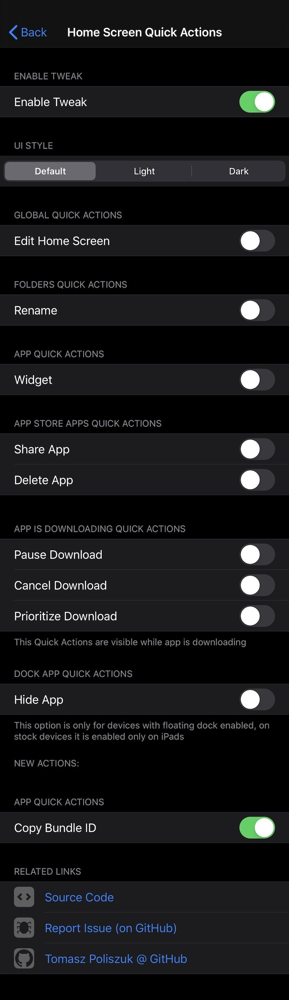
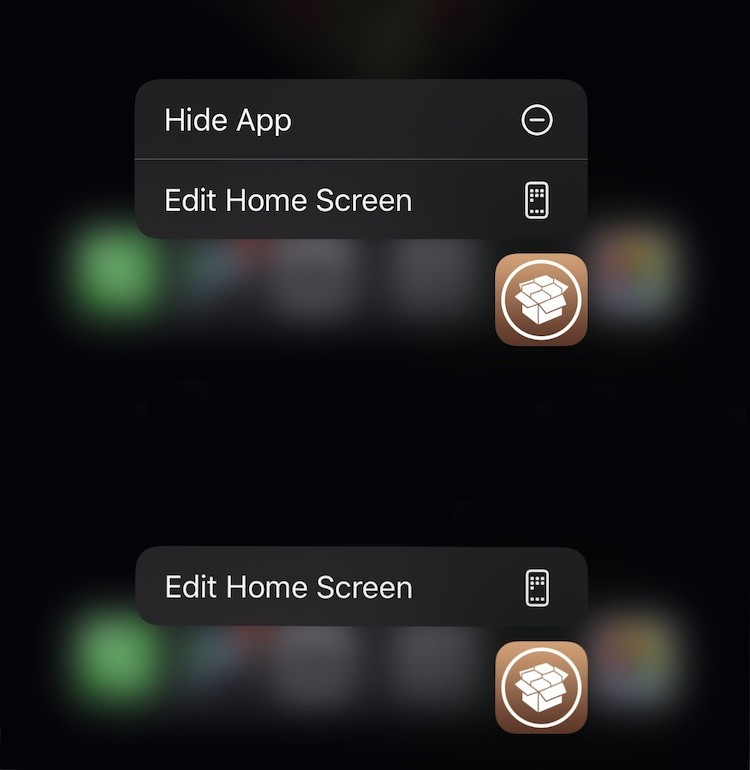
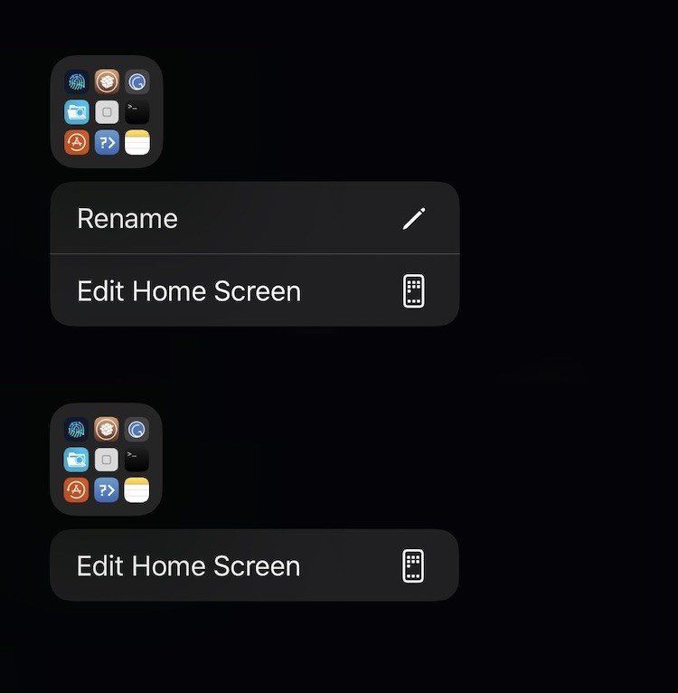
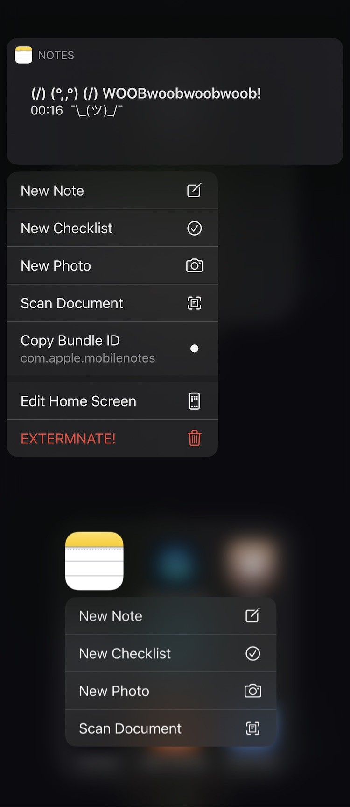

*Select which Home Screen Quick Actions should be enabled*

**Requires iOS greater or equal to 13**

**Global Quick actions:**
- Edit Home Screen

**Folders Quick actions:**
- Rename

**App Quick Actions:**
- Widget

**App Store apps Quick actions:**
- Share App
- Delete App

**App Quick actions visible while app is downloading:**
- Pause Download
- Cancel Download
- Prioritize Download

**Dock Quick app actions:**
- Hide App (This option is only for devices with floating dock enabled, on stock devices it is enabled only on iPads)

Configure options from Settings.

This tweak is open sourced [on Github](https://github.com/tomaszpoliszuk/HomeScreenQuickActions)
