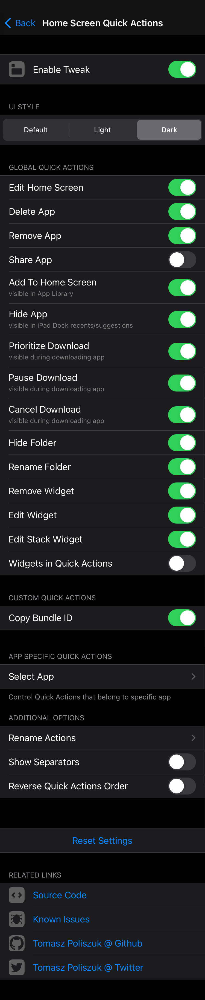
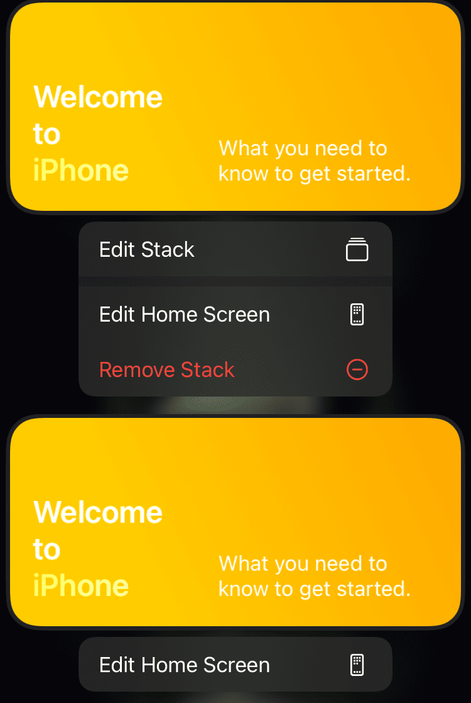

# Home Screen Quick Actions
Control Home Screen Quick Actions on your device

## Compatibility
iOS 13 and above

## Features:
* Control UI Style of Home Screen Quick Actions
* Select what Home Screen Quick Actions should be visible:
	* Installed Applications (Native):
		* Delete App
		* Edit Home Screen
		* Share App
		* Show all Windows
		* App Specific Quick Actions
	* Installed Applications (Custom):
		* Share Bundle ID (Beta)
		* Copy Bundle ID
		* Open App in Filza
		* Clear Badge
		* Clear App Cache
		* Reset App
		* Offload App
	* Offloaded Applications (Native):
		* Edit Home Screen
	* Offloaded Applications (Custom):
		* Share Bundle ID (Beta)
		* Copy Bundle ID
		* Open App in Filza
	* Folders (Native):
		* Remove Folder
		* Edit Home Screen
		* Rename Folder
		* Show Apps with Badges
	* Folders (Custom):
		* Share Bundle IDs (Beta)
		* Copy Bundle IDs
		* Clear Badges
		* Clear Apps Cache (Beta)
		* Reset Apps (Beta)
		* Offload Apps
		* List Apps In Folder (Beta)
	* Widgets (Native):
		* Remove Widget (iOS14)
		* Edit Home Screen
		* Edit Widget (iOS14)
		* Edit Stack Widget (iOS14)
		* Widgets in Quick Actions (iOS13)
	* Bookmarks (Native):
		* Delete Bookmark
		* Share Bookmark
		* Edit Home Screen
	* Visible in App Library (Native):
		* Add To Home Screen (iOS14)
	* Visible during downloading app (Native):
		* Prioritize Download
		* Pause Download
		* Cancel Download
	* Visible in iPad Dock recents (Native):
		* Hide App
* Additional options
	* Show/Hide Separators
	* Reverse Quick Actions Order
	* Rename Actions (change titles and add/change subtitles)

Configure options from Settings

## Credits:
* [ArtikusHG](https://github.com/ArtikusHG) for [PSSearchableListController](https://github.com/ArtikusHG/NeonBoard/blob/a0dc05eec94003707b20a17c6824fb7bb704c521/neonboardprefs/PSSearchableListController.m) and it's implementation [NBPSelectAppController](https://github.com/ArtikusHG/NeonBoard/blob/a0dc05eec94003707b20a17c6824fb7bb704c521/neonboardprefs/NBPSelectAppController.m) from [NeonBoard](https://github.com/ArtikusHG/NeonBoard/)
* [EthanRDoesMC](https://github.com/EthanRDoesMC) for [Home Screen QUick Actions UI Style](https://github.com/EthanRDoesMC/Dawn/blob/c3b6b6ab97805193627f0af62bd16feeea0a2b0f/Tweak.xm#L406-L413) from [Dawn](https://github.com/EthanRDoesMC/Dawn/)
* [Ryan Petrich](https://github.com/rpetrich) for [Clear Cache and Reset app code](https://github.com/rpetrich/CacheClearer/blob/216dd186aface6243ca94810bf9fbadc5f8c3066/Tweak.x#L25-L90) from [CacheClearer](https://github.com/rpetrich/CacheClearer/)

## Screenshots:

